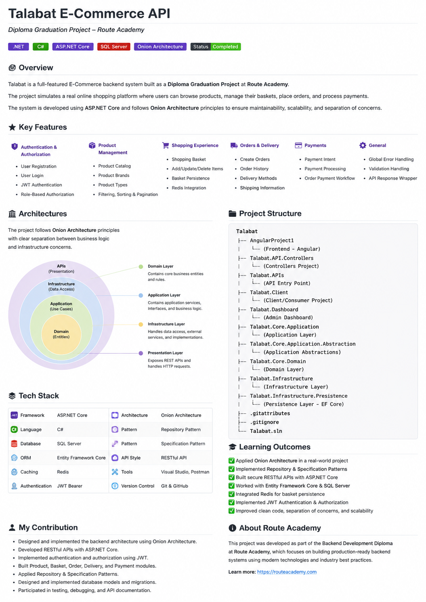

# Talabat E-Commerce API


## Overview

Talabat E-Commerce API is a backend application developed as part of the Route Academy Backend Development Diploma.

The project simulates a modern e-commerce platform that allows customers to browse products, manage shopping baskets, place orders, and process payments through a scalable and maintainable architecture.

The system was built using ASP.NET Core, Entity Framework Core, SQL Server, and Redis while applying Onion Architecture principles and industry-standard backend development practices.

---



## Features

### Authentication & Authorization

- User Registration
- User Login
- JWT Authentication
- Role-Based Authorization

### Product Management

- Product Catalog
- Product Types
- Product Brands
- Product Filtering
- Product Sorting
- Product Pagination

### Basket Management

- Create Basket
- Update Basket
- Delete Basket
- Redis Basket Storage

### Orders

- Create Orders
- Order History
- Delivery Methods
- Shipping Information

### Payments

- Payment Processing
- Payment Intent Creation
- Order Payment Workflow

### Error Handling

- Custom Error Responses
- Validation Handling
- Global Exception Middleware

---

## Architecture

The project follows Onion Architecture principles to ensure maintainability, scalability, testability, and clear separation of concerns.

### Layers

| Layer | Responsibility |
|---------|---------|
| Core | Business Logic & Entities |
| Repository | Data Access Layer |
| API | Controllers & Endpoints |
| Infrastructure | Database & External Services |

### Design Principles

- Onion Architecture
- Separation of Concerns
- Dependency Injection
- Repository Pattern
- Specification Pattern
- SOLID Principles

---

## Technology Stack

### Backend

- ASP.NET Core
- C#
- Entity Framework Core
- LINQ
- RESTful APIs

### Database

- SQL Server
- Redis

### Authentication

- JWT Authentication
- ASP.NET Identity

### Development Tools

- Visual Studio
- Postman
- Git
- GitHub

---

## Design Patterns

The project implements several software design patterns:

- Repository Pattern
- Specification Pattern
- Dependency Injection
- Unit of Work Pattern
- Generic Repository Pattern

---

## Project Structure

```text
Talabat
│
├── Talabat.APIs
│
├── Talabat.API.Controllers
│
├── Talabat.Core
│   ├── Talabat.Core.Application
│   ├── Talabat.Core.Application.Abstraction
│   └── Talabat.Core.Domain
│
├── Talabat.Infrastructure
│   ├── Talabat.Infrastructure
│   └── Talabat.Infrastructure.Presistence
│
├── Talabat.Client
│
├── Talabat.Dashboard
│
└── AngularProject1
```

---

## API Modules

### Authentication

- Register
- Login

### Products

- Get Products
- Get Product Details
- Filter Products
- Sort Products

### Basket

- Create Basket
- Update Basket
- Delete Basket

### Orders

- Create Order
- Get Orders
- Get Delivery Methods

### Payments

- Create Payment Intent
- Process Payment

---

## Security

The application implements:

- JWT Authentication
- Role-Based Authorization
- Secure Password Hashing
- Protected Endpoints
- Input Validation

---

## Learning Outcomes

Through the Route Academy Backend Development Diploma, this project provided hands-on experience with:

- ASP.NET Core Web API Development
- Onion Architecture
- Entity Framework Core
- SQL Server
- Redis Caching
- Repository Pattern
- Specification Pattern
- JWT Authentication & Authorization
- RESTful API Design
- Dependency Injection
- SOLID Principles
- Software Design Patterns
- Layered Application Development
- Real-World Backend Development Practices

---

## My Contribution

- Developed RESTful APIs using ASP.NET Core.
- Implemented Authentication and Authorization.
- Built Product, Basket, Order, and Payment modules.
- Applied Repository and Specification Patterns.
- Designed and managed database operations.
- Implemented business logic and service layers.
- Participated in testing and debugging.

---

## License

This project was developed as part of the Backend Development Diploma at Route Academy.

The diploma focuses on building production-ready backend applications using modern technologies, software architecture patterns, and industry best practices.

---

## Contact

### Ibrahim Mokhtar Ahmed Saad

- LinkedIn: https://linkedin.com/in/ibrahim-mokhtar-16966a378
- GitHub: https://github.com/Ibrahim-Mokhtar
- Email: ibrahim.mokhtar1611@gmail.com
